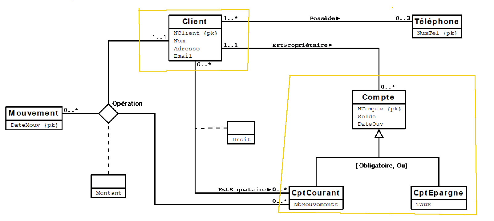

# db-scheme


# Question1

**Client**: Il est posssible de traduire la table client en object. C'est ce que nous avons choisis de faire vu que l'accès à cette entité se fait fréquement. Nous supposons aussi que cette entité joue un role centrale dans la base de données, et que l'accès à cette entité est le plus fréquent. 

L'association **Possède** sera traduite par un champs de type *VARRAY* de taille maximale 3 qui vas contenir les numéros de télephone. Cela implique que l'entité **Téléphone** sera représenté par le type *char*

L'association **Opération** sera représenté par un type **T_Operation** comprenant une référence vers l'Entité **Mouvement** et **CptCourant**. Ce type comprends aussi un champs **Montant** qui sera donc representé par sa valeur numérique. L'entité **Mouvement** sera representé par un type *char*

On a choisit de traduire **CptCourant**, **CptEpargne** et **Compte** en des objets à cause de l'héritage entre **CptCourant** et **Compte** et entre **CptEpargne** et **Compte** avec l'obligation "ou".

Pour la liaison entre **Client** et **CptCourant** on pense que le passage le plus fréquant est celle de **Client** vers **CptCourant**. pour la traduction on va créer un type **T_EstSignataire** avec comme 
attributs ***droit*** de type ***varchar*** et ***CptCourant*** de type ***T_CptCourant***. et on va ajouter un nested table de ***T_EstSignataire*** comme attribut dans T_Client.

# Question2

```SQL

DROP TYPE T_Compte;
Create or REPLACE TYPE T_Compte as OBJECT (
        NCompte varchar(20),
        Solde INTEGER,
        DateOuv DATE
) not final;
/

DROP TYPE T_CptEpargne;
Create or REPLACE  TYPE T_CptEpargne under T_Compte (
        Taux float
) not final;
/

DROP TYPE T_CptCourant;
Create or REPLACE TYPE T_CptCourant under T_Compte (
        NbMouvements INTEGER
) not final;
/

DROP TYPE T_Operation;
Create or REPLACE TYPE T_Operation as OBJECT (
        DateMouv char(10),
        CptCourant T_cptCourant,
        Montant INTEGER
) not final;
/

DROP TYPE T_EstSignataire;
create or REPLACE TYPE T_EstSignataire as OBJECT (
        Droit varchar(40),
        CptCourant T_CptCourant
) not final;
/

DROP TYPE T_Possede;
CREATE or REPLACE TYPE T_Possede is 
    VARRAY(3) of char(10);
/

DROP TYPE NT_EstProprietaire;
Create or REPLACE TYPE NT_EstProprietaire as table of T_Compte;
/

DROP TYPE NT_EstSignataire;
Create or REPLACE TYPE NT_EstSignataire as table of T_EstSignataire;
/

DROP TYPE NT_Operation;
Create or REPLACE TYPE NT_Operation as table of T_Operation;
/

DROP TYPE T_Client;
create or REPLACE TYPE T_Client as OBJECT (
        NClient INTEGER,
        Nom varchar(747),
        Adresse varchar(700),
        Email VARCHAR(757),
        EstSignataire NT_EstSignataire,
        Possede T_Possede,
        Operation NT_Operation,
        EstProprietaire NT_EstProprietaire,
        MEMBER PROCEDURE add_account(account T_Compte),
        MEMBER PROCEDURE add_operation(opeartion T_operation)
) not final;
/

DROP TABLE Clients
CREATE TABLE Clients of T_Client (
        NClient PRIMARY key
)
nested table EstSignataire store as LesSignataires,
nested table Operation store as LesOperations,
nested table EstProprietaire store as LesProprietaire
;

DROP TYPE BODY T_Client;
CREATE OR REPLACE TYPE BODY T_Client AS
    MEMBER PROCEDURE add_account(account T_Compte) IS
    BEGIN
        IF EstProprietaire IS NULL THEN
            EstProprietaire := NT_EstProprietaire();
        END IF;
        EstProprietaire.EXTEND;
        EstProprietaire(EstProprietaire.LAST) := account;
    END;
END;
/
```